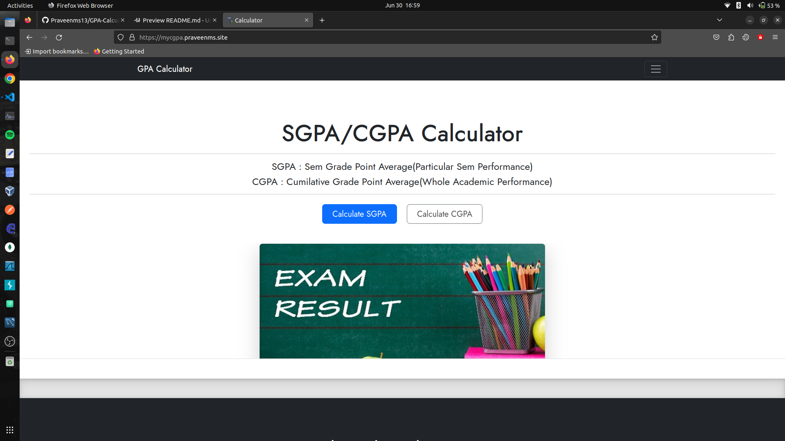

# CGPS/SGPA Calculator 

## Click [Here](https://mycgpa.praveenms.site) to view the project
 
## Appendix

This project is a simple GPA (Grade Point Average) calculator designed specifically for engineering students. It allows users to calculate both CGPA (Cumulative Grade Point Average) and SGPA (Semester Grade Point Average) grades based on their course credits and grades. The calculator provides an intuitive user interface and is implemented using JavaScript.

## Features

- Calculate CGPA: The calculator enables students to compute their CGPA, which represents the average performance across all semesters.
- Calculate SGPA: Students can calculate their SGPA for a specific semester by entering the grades and corresponding credits.
- Track Semester GPAs: The calculator keeps track of all semester GPAs, allowing students to view their performance for each individual semester.
- User-Friendly UI: The interface is designed to be simple and intuitive, making it easy for users to enter their grades and credits.

## Disclaimer

This GPA calculator is intended for educational purposes only. While efforts have been made to ensure its accuracy, it is recommended to cross-verify the calculated GPAs with official university systems for precise results. The developers of this calculator are not responsible for any discrepancies that may arise from the usage of this tool.

  

## Screenshots

